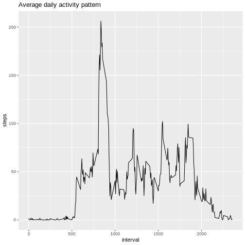

## Introduction
This assignment makes use of data from a personal activity monitoring
device. This device collects data at 5 minute intervals through out the
day. The data consists of two months of data from an anonymous
individual collected during the months of October and November, 2012
and include the number of steps taken in 5 minute intervals each day.

The variables included in this data set are:

* **steps**: Number of steps taking in a 5-minute interval (missing
    values are coded as `NA`)

* **date**: The date on which the measurement was taken in YYYY-MM-DD
    format

* **interval**: Identifier for the 5-minute interval in which
    measurement was taken

## Loading and preprocessing the data


In this part of the assignment we check if the source data file exists and has
been un-zipped... we then read the content of the CSV file into a data frame. To
simplify the data frame manipulations we use dplyr library. For plotting we use
the ggplot2 library.

```r
if (("activity.zip" %in% dir()) & !("activity.csv" %in% dir())) {
  # and un-zip, if necessary
  unzip("activity.zip")
}

activity <- read.table("activity.csv",
                       header = TRUE,
                       sep = ",",
                       na.strings = "NA",
                       colClasses = c("integer","Date","integer"))

library(dplyr)
library(ggplot2)
```


## What is mean total number of steps taken per day?

To answer the first question of the assignment we will ignore the missing values
in the dataset.

We summarize the number of steps per day in a new data frame named **daily**. 


```r
# summarize the number of steps per day
daily <- activity %>%
  group_by(date) %>%
  summarise(steps = sum(steps, na.rm = TRUE))

# show summary of the daily activity (mean, median)
summary(daily$steps)
```

```
##    Min. 1st Qu.  Median    Mean 3rd Qu.    Max. 
##       0    6778   10395    9354   12811   21194
```

```r
# and produce the values so that we can use them in markdown text
activityMean <- as.integer(mean(daily$steps))
activityMedian <- as.integer(median(daily$steps))
```

And show the **mean** = 9354 and **median** = 10395 total number of steps taken per day.


Finally, we make a histogram of the total number of steps taken each day


```r
# plot a histogram
ggplot(data = daily, aes(x = steps)) +
  geom_histogram(color="black", fill="white") +
  labs(title = "Number of steps taken each day")
```


## What is the average daily activity pattern?

To answer this question, we create a new data frame **avgDaily** grouped by
interval. With this data frame we compute average number of steps for each
interval across all days.


```r
# average daily activity pattern
avgDaily <- activity %>%
  group_by(interval) %>%
  summarise(steps = mean(steps, na.rm = TRUE))
```

And plot a time series graph representing the **average daily activity pattern**.


```r
# plot a time series
ggplot(data = avgDaily, aes(x = interval, y = steps)) +
  geom_line(color="black") +
  labs(title = "Average daily activity pattern")
```



```r
# find the most active interval
mostActive <- avgDaily[[which.max(avgDaily$steps),1]]
```

The 5-minute interval ending at the minute **#835**, on average across all the days in the dataset, contains the maximum number of steps.

## Imputing missing values

We note that there are a number of days/intervals where there are missing
values (coded as `NA`). The presence of missing days introduces bias into some
calculations or summaries of the data.

We calculate and report the total number of missing values in the dataset (i.e. the total number of rows with `NA`s).


```r
# calculate the number of missing values in the dataset
sum(is.na(activity))
```

```
## [1] 2304
```

To deal with the missing data, we devise a strategy for filling in all of the
missing values in the dataset. The strategy uses average number of steps computed
in the previous step (average daily pattern) to fill the "blanks". We create a
new **patched** dataset that is equal to the original dataset but with the
missing data filled in.


```r
# impute missing values by substituting with average daily activity
patched <- activity %>%
  group_by(interval) %>%
  mutate(steps = ifelse(is.na(steps),
                        as.integer(avgDaily[[which(avgDaily$interval == interval), 2]]),
                        steps)) %>%
  ungroup()
```

We calculate and report the **mean** and **median** total number of steps taken per day.


```r
# summarize the number of steps per day
dailyPatched <- patched %>%
  group_by(date) %>%
  summarise(steps = sum(steps, na.rm = TRUE))

# show summary of the daily activity (mean, median)
summary(dailyPatched$steps)
```

```
##    Min. 1st Qu.  Median    Mean 3rd Qu.    Max. 
##      41    9819   10641   10750   12811   21194
```

```r
# and produce the values so that we can use them in markdown text
patchedMean <- as.integer(mean(dailyPatched$steps))
patchedMedian <- as.integer(median(dailyPatched$steps))
```

And show the **mean** = 10749 and **median** = 10641 total number of steps taken per day...

The comparison with original data set reveals the difference (increased number of steps):

| Original dataset | Imputted dataset |
| ---              | ---              |
| mean = 9354 | mean = 10749 |
| median = 10395 | median = 10641 |


With the new dataset we make a new histogram of the total number of steps taken each day.


```r
# plot a histogram
ggplot(data = dailyPatched, aes(x = steps)) +
  geom_histogram(color="black", fill="white") +
  labs(title = "Number of steps taken each day (imputed data)")
```


## Are there differences in activity patterns between weekdays and weekends?

For this part of the assignment we create a new factor variable in the dataset with two levels -- "weekday" and "weekend" indicating whether a given date is a weekday or weekend day. The new data frame **enhanced** has this new factor variable.


```r
# add new variable indicating whether a given date is a weekday or weekend
enhanced <- patched %>%
  mutate(day = as.factor(weekdays(date)), weekday = as.factor(ifelse(day %in% c("Saturday", "Sunday"), "weekend", "weekday")))
```

Finally, we compute the new daily activity patterns and show them on a panel time series plot.


```r
# average daily enhanced activity pattern
avgDailyEnh <- enhanced %>%
  group_by(interval, weekday) %>%
  summarise(steps = mean(steps, na.rm = TRUE))

# plot a time series
ggplot(data = avgDailyEnh, aes(x = interval, y = steps)) +
  geom_line(color="black") +
  facet_grid(rows = vars(weekday)) +
  labs(title = "Average daily activity pattern")
```


